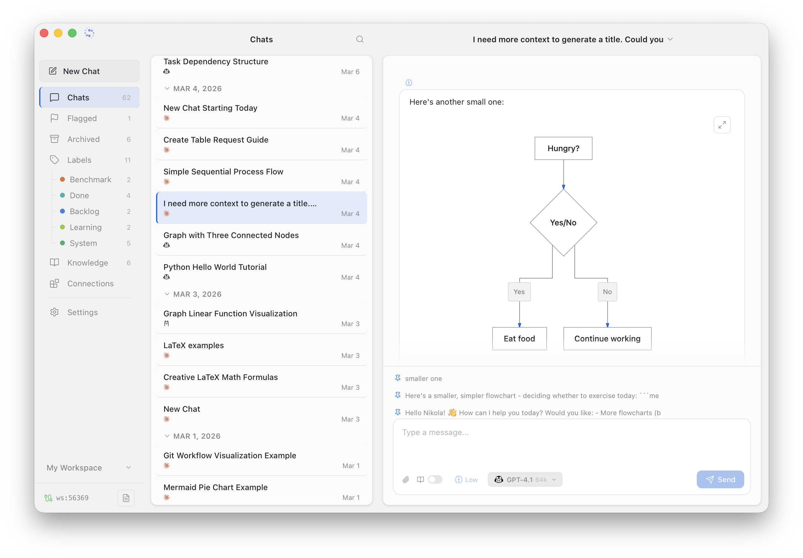
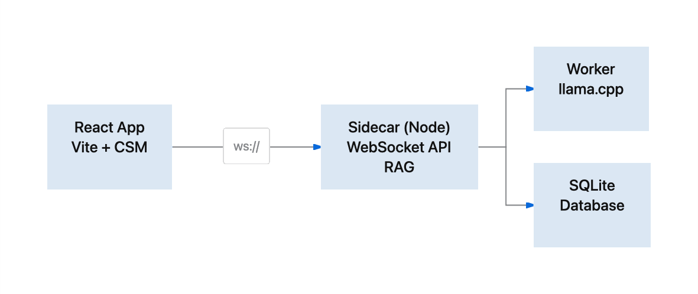

<p align="center">
  
</p>

<h1 align="center">Sparky</h1>
<p align="center"><a href="https://getsparky.chat">getsparky.chat</a></p>

<p align="center">
  <a href="https://github.com/lepijohnny/sparky/actions/workflows/ci.yml"></a>
</p>

<p align="center">
  A private, local-first desktop AI assistant with multi-provider LLM support, built-in knowledge base, and service integrations.
</p>

<p align="center">
  <em>Built with the help of coding agents (<a href="https://www.anthropic.com/claude-code">Claude Code</a>, <a href="https://github.com/features/copilot">GitHub Copilot</a>).</em>
</p>

<p align="center">
  
  
  <a href="https://github.com/lepijohnny/sparky/releases/latest"></a>
</p>

<p align="center">
  
  
  
  
  
  
</p>

<p align="center"></p>

## Features

- **Multi-provider LLM** — Anthropic Claude, OpenAI ChatGPT, GitHub Copilot, Google Gemini, Mistral, Ollama (local models), more to come
- **Skills** — Extensible skill system for specialized agent behaviors
- **Local knowledge base** — RAG pipeline with hybrid BM25 + vector search + reranker, local embeddings via llama.cpp
- **Service connections** — Connect APIs (GitHub, Gmail, Telegram, Todoist, etc.) with built-in proxy and approval system
- **MCP auto-discovery** — Automatically registers MCP-compatible service endpoints
- **Approval system** — Destructive actions require user confirmation before execution
- **Rich rendering** — Mermaid diagrams, KaTeX math, ECharts, syntax-highlighted code, tables
- **Roles & prompts** — Built-in role system for different conversation contexts
- **Knowledge anchors** — Pin important messages to always include in context
- **Rolling summaries** — Automatic conversation summarization to extend context
- **Themes** — Light and dark themes with custom theme support
- **Multi-workspace** — Isolated workspaces with separate chats, settings, and knowledge bases
- **Chat organization** — Flags, labels, and archives to keep conversations organized
- **Print** — Export conversations with per-message visibility toggle
- **Attachments** — Attach files to messages (images, documents, code)
- **Privacy-first** — All data stored locally in SQLite. No telemetry. Your conversations never leave your machine.

## Knowledge Base

Add documents (PDF, Markdown, text, URLs) as sources. Sparky chunks, embeds, and indexes them locally. When you chat, relevant chunks are retrieved using hybrid BM25 + vector search, reranked, and injected into context.

## Extractor Plugins

Install custom extractors to support new source types:

```bash
bash <(curl -fsSL https://raw.githubusercontent.com/lepijohnny/sparky-extractors/main/install.sh) sparky-url-extractor
```

Plugins are automatically discovered on startup. See [`sparky-extractors`](https://github.com/lepijohnny/sparky-extractors) for available plugins.

## Architecture

<p align="center"></p>

| Layer | Role |
|-------|------|
| **Tauri (Rust)** | Persistent process. Window management, file dialogs, model downloads, chat printing, sidecar lifecycle. |
| **Sidecar (Node)** | WebSocket server. Chat, knowledge indexing, LLM routing, service proxy. Runs under bundled Node v22. |
| **Worker (Node)** | Child process for llama.cpp inference — embedding, keyword extraction, query expansion, reranking. |
| **React App** | Vite + React 19 + CSS Modules. Communicates with sidecar over WebSocket. Tauri APIs for native features. |

## Quick Start

### Prerequisites

- [Rust](https://www.rust-lang.org/tools/install) 1.93+ (for Tauri)
- [pnpm](https://pnpm.io/installation) (package manager)
- Node v22 via [fnm](https://github.com/Schniz/fnm) (reads `.node-version`)

### Build & Run (macOS)

```bash
# Install fnm (if you don't have it) and activate Node 22
brew install fnm
eval "$(fnm env --use-on-cd)"
fnm install && fnm use

# Enable pnpm via corepack (ships with Node)
corepack enable pnpm

# Install dependencies
pnpm install
cd server && pnpm rebuild better-sqlite3 sqlite-vec && cd ..

# Run in development
cargo tauri dev

# Build production DMG
cd server && npx tsx build.ts && cd ..
cd app && pnpm run build && cd ..
cargo tauri build --bundles dmg
```

### Build & Run (Windows)

```powershell
# Install fnm (first time only)
winget install Schniz.fnm

# Activate fnm in current shell, then install and switch to Node 22
fnm env --use-on-cd --shell powershell | Out-String | Invoke-Expression
fnm install
fnm use

# Enable pnpm via corepack (ships with Node)
corepack enable pnpm

# Install dependencies
pnpm install
cd server; pnpm rebuild better-sqlite3 sqlite-vec; cd ..

# Run in development
cargo tauri dev

# Build installer
cd server; npx tsx build.ts; cd ..
cd app; pnpm run build; cd ..
cargo tauri build --bundles nsis
```

### Testing

```bash
# Frontend
cd app && pnpm test

# Backend
cd server && npx vitest run
```

## LLM Providers

| Provider | Auth | Local | Notes |
|----------|------|-------|-------|
| **Anthropic** | OAuth / API key | No | Pro/Max or API (key) |
| **OpenAI** | OAuth / API key | No | ChatGPT (OAuth) or API (key) |
| **GitHub Copilot** | Device flow | No | Requires Copilot subscription |
| **Google Gemini** | OAuth | No | Cloud Code Assist endpoint |
| **Mistral** | API key | No | Mistral Large, Medium, Small, Pixtral, Codestral, etc. |
| **Ollama** | None | Yes | Any GGUF model. Fully offline. |
| **LM Studio** | None | Yes | Any GGUF model. Fully offline. |

## Service Connections

Connect external APIs and call them from chat. Supported auth strategies:

| Strategy | Use case |
|----------|----------|
| `bearer` | Standard API token |
| `oauth` | OAuth 2.0 PKCE flow |
| `bot` | Bot tokens (Discord) |
| `url` | Token in URL path (Telegram) |
| `basic` | Basic auth |
| `header` / `query` | Custom header or query param |

## Project Structure

```
app/                React frontend (Vite, React 19, TypeScript, CSS Modules)
auth-core/          Shared auth types (AuthFlow, grants, OAuth)
auth-flows/         Auth flow plugins (PAT, local, device, OAuth PKCE)
server/             Node.js sidecar (TypeScript, WebSocket API)
  chat/             Chat CRUD, conversation loop, context builder
  core/             Adapters, bus, auth, proxy, registry, search
  knowledge/        RAG pipeline — chunking, indexing, search, worker
  prompts/          Built-in role files, API docs, format guides
  settings/         Workspace settings (appearance, labels, LLM, profile)
  skills/           Skill CRUD, import/export, review pipeline
  tools/            Tool definitions with Zod schemas (app_* naming)
src-tauri/          Tauri shell (Rust) — window, IPC, model downloads, sidecar
scripts/            Build helpers (macOS, Windows)
docs/               Architecture docs and assets
website/            Documentation site — getsparky.chat (Docusaurus)
```

## Local State

All data stays on your machine in `~/.sparky/`:

```
~/.sparky/
├── config.json              Global app config
├── cred.enc                 Encrypted credentials
├── trust.enc                Encrypted tool approval rules and permission mode
├── models/                  Shared GGUF models (embed, rerank)
├── plugins/ext/             Extractor plugins
├── skills/                  Installed skills (each a folder with SKILL.md)
├── themes/                  Custom UI themes
└── workspaces/
    └── <name>/
        ├── workspace.db     SQLite — chats, messages, settings, labels
        └── workspace.kt.db  SQLite + sqlite-vec — knowledge chunks, FTS5, vectors
```

All secrets (API keys, tokens) are stored in the **OS native keychain** (macOS Keychain, Windows Credential Manager) — never in plain text.

## Contributing

Contributions are welcome! Please see [CONTRIBUTING.md](CONTRIBUTING.md) for guidelines.

## License

[Apache 2.0](LICENSE)
