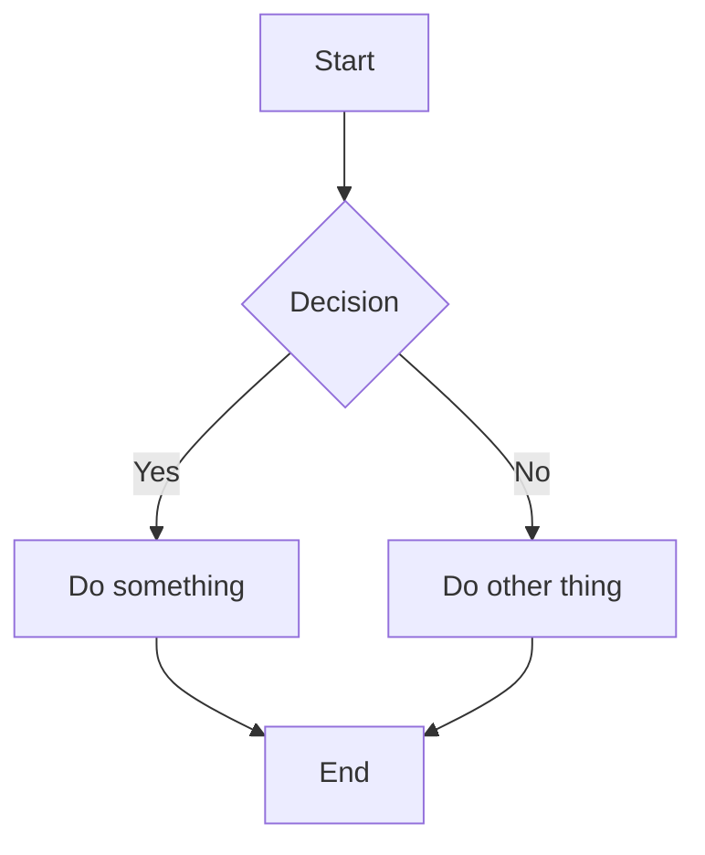
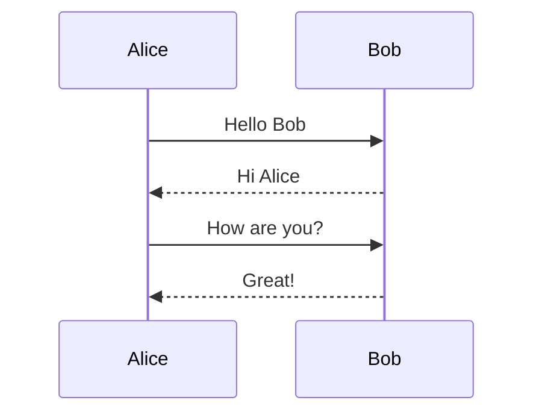
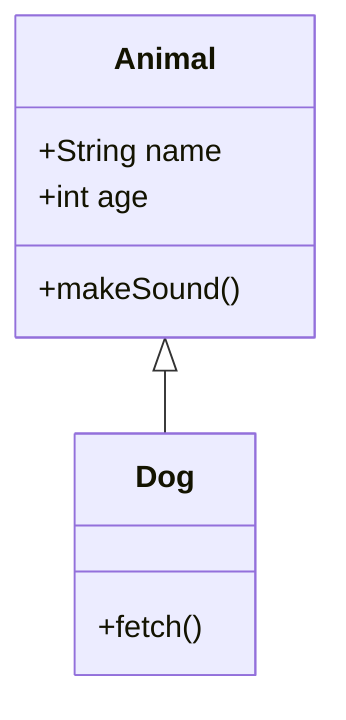
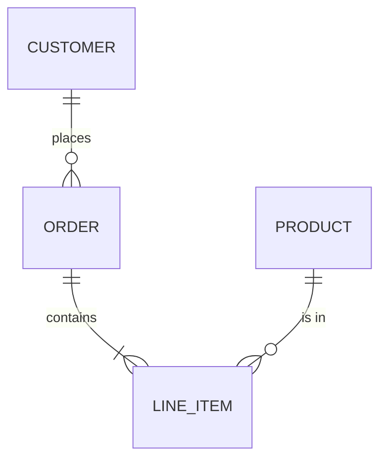
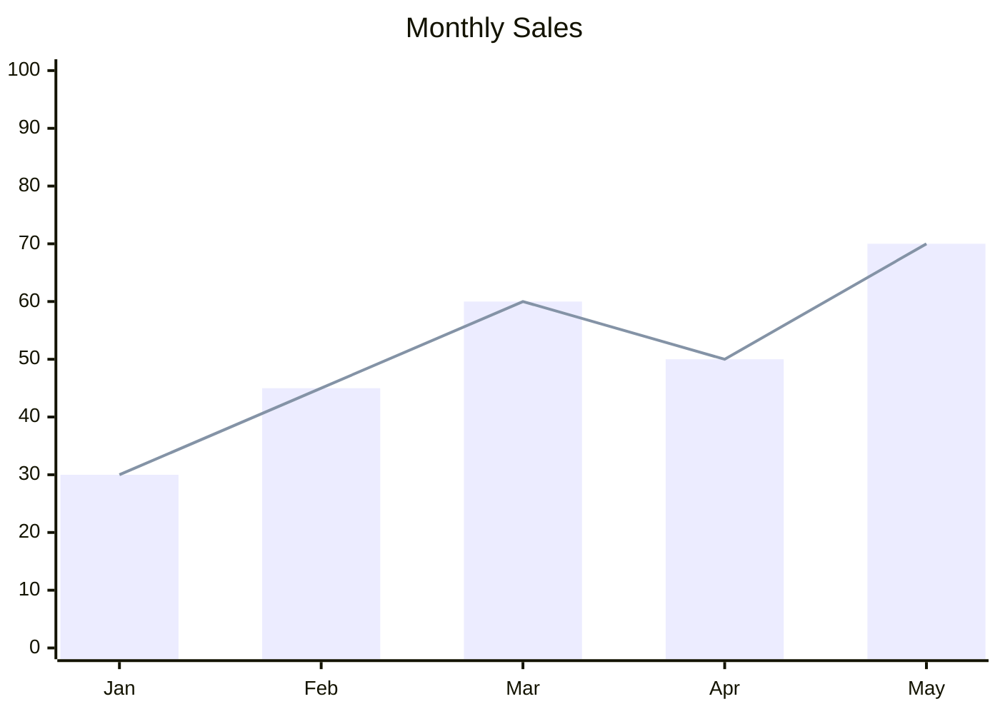
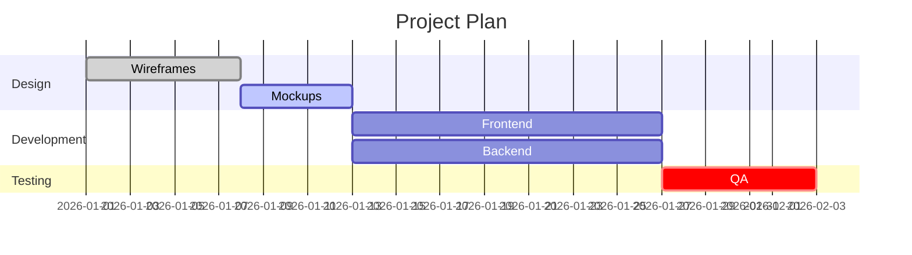

# Mermaid Diagrams

When the user asks for a graph, diagram, chart, or any visual representation, create it using Mermaid syntax inside a ```mermaid code block. The app renders Mermaid automatically.

## Supported Diagram Types

### Flowchart


### Sequence Diagram


### Class Diagram


### ER Diagram


### XY Chart (bar/line)


Important xychart syntax rules:
- Use `xychart-beta` as the header
- x-axis categories must use brackets: `x-axis ["a", "b", "c"]`
- x-axis numeric range uses arrows: `x-axis 0 --> 100`
- y-axis range uses arrows: `y-axis 0 --> 100`
- Data series use brackets: `bar [1, 2, 3]` or `line [1, 2, 3]`
- Do NOT use colon-semicolon syntax like `line "name" : 1,2; 3,4`

### Gantt Chart


Gantt task syntax: `Task Name :tags, id, start, duration`
- Tags: `done`, `active`, `crit` (optional, comma-separated)
- Start: a date like `2026-01-01` or `after <id>` for dependencies
- Duration: `7d` (days), `2w` (weeks), `8h` (hours)
