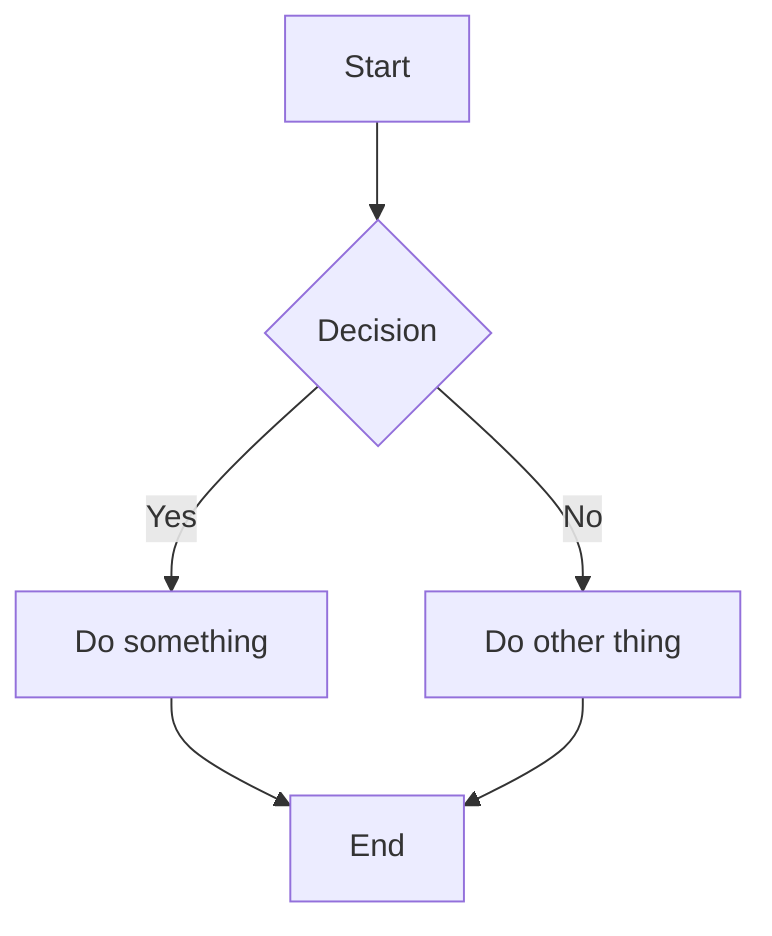
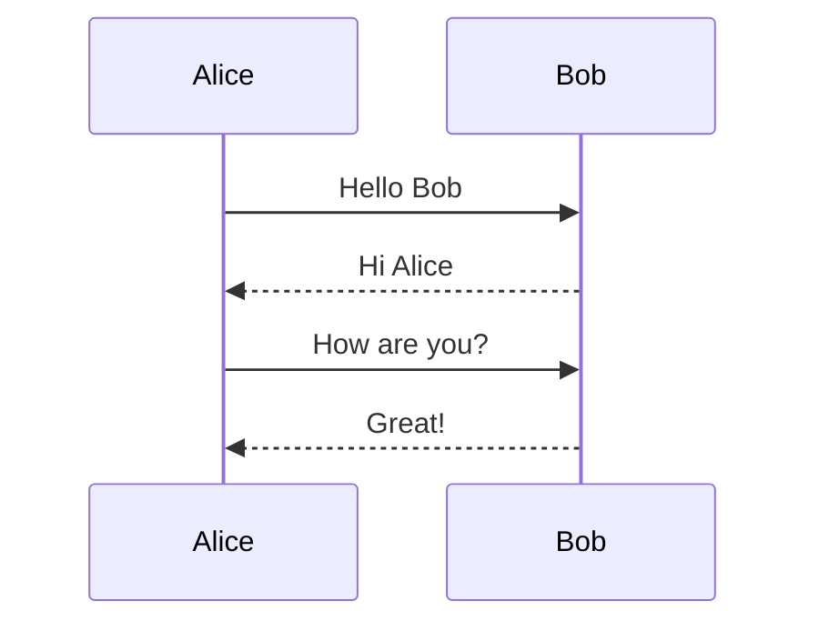
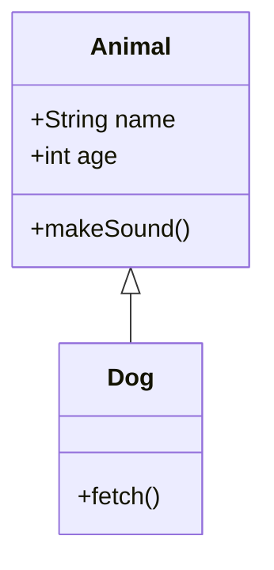
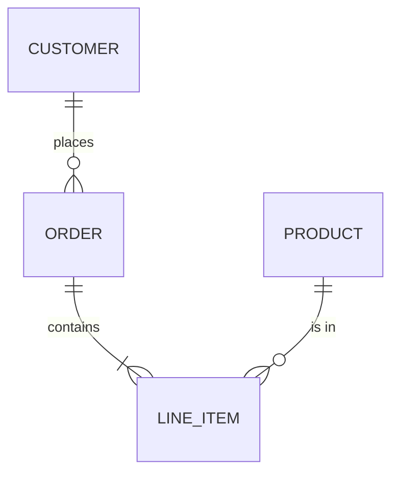
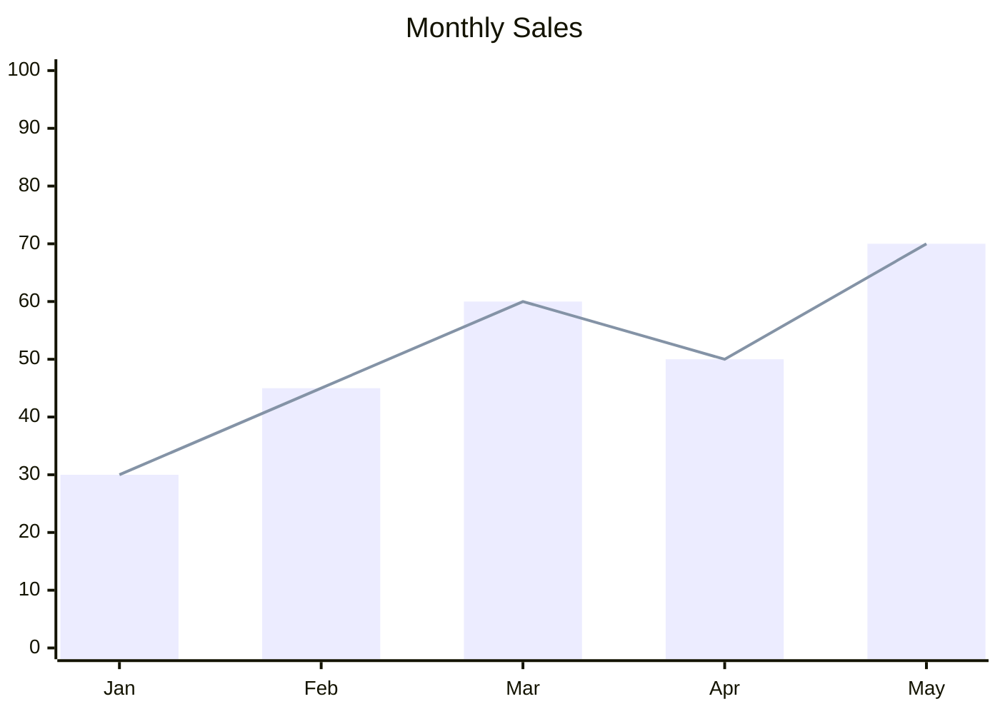
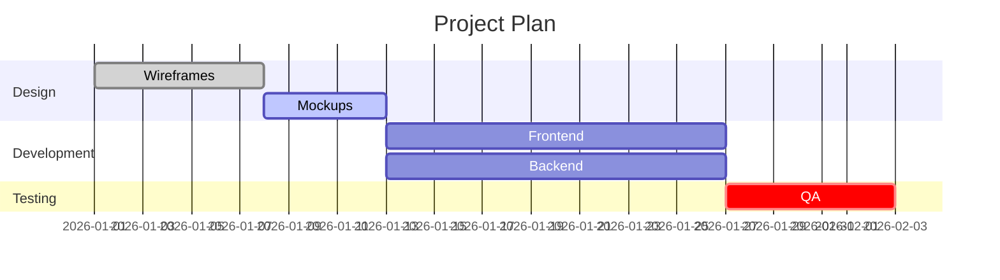

# Mermaid Diagrams

## Intro

Render diagrams using a ` ```mermaid ` fenced code block with Mermaid syntax. The app renders the diagram automatically.

## When to Use

| User request | Diagram type | Mermaid header |
|-------------|-------------|----------------|
| Flowchart, process, workflow, decision tree | Flowchart | `flowchart TD` |
| API flow, message exchange, protocol | Sequence | `sequenceDiagram` |
| Object hierarchy, inheritance, OOP | Class | `classDiagram` |
| Database schema, entity relationships | ER | `erDiagram` |
| Project timeline, schedule, milestones | Gantt | `gantt` |
| Simple bar/line chart (small data) | XY Chart | `xychart-beta` |
| State machine, transitions | State | `stateDiagram-v2` |

## Examples

### Flowchart


### Sequence Diagram


### Class Diagram


### ER Diagram


### XY Chart


### Gantt Chart


## Common Mistakes

| Mistake | Fix |
|---------|-----|
| `xychart` without `-beta` | Use `xychart-beta` — it's still in beta |
| XY chart colon-semicolon syntax: `line "name" : 1,2; 3,4` | Use bracket syntax: `line [1, 2, 3, 4]` |
| XY chart x-axis without brackets: `x-axis Jan, Feb` | Use brackets: `x-axis ["Jan", "Feb"]` |
| Gantt task missing commas between fields | Use: `Task :tags, id, start, duration` |
| Flowchart missing direction (`TD`, `LR`) | Always specify: `flowchart TD` or `flowchart LR` |
| Sequence diagram `->` instead of `->>` | Use `->>` for solid arrows, `-->>` for dashed |
