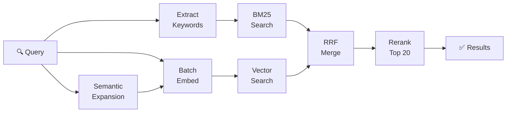

Knowledge

# RAG

Retrieval-Augmented Generation powered by your local documents.

Sparky includes a production-grade RAG system that runs entirely on your machine. Add documents, code files, and URLs as knowledge sources. Sparky chunks, embeds, and indexes everything locally using llama.cpp. No data leaves your machine and no external API calls are made.

When knowledge is enabled for a chat, Sparky automatically retrieves relevant chunks from your indexed sources and includes them in the context sent to the agent. The agent can then reference your documents to answer questions, synthesize information, or provide grounded responses.

## How It Works

1. **Add sources** — add files, folders, or URLs from the Knowledge section in the sidebar
2. **Indexing** — Sparky splits documents into chunks, generates embeddings, and builds a full-text search index
3. **Retrieval** — when you ask a question with knowledge enabled, Sparky searches your index using hybrid search (BM25 + vector similarity) and reranks the results
4. **Augmentation** — the most relevant chunks are injected into the conversation context before the agent responds

## Supported Indexing Formats

Text files, Markdown, PDF, HTML, and URLs are supported out of the box. Additional formats can be added through extractor plugins.

## BM25 (Keyword Search)

BM25 is a traditional keyword-based ranking algorithm powered by SQLite FTS5. It matches documents based on exact term frequency and is fast, predictable, and works well when you know the exact terminology.

**Best for:** exact matches, code symbols, technical terms, known keywords.

## Hybrid Search

Hybrid search combines BM25 keyword matching with vector similarity search. Documents are embedded using a local model (via llama.cpp) and stored in sqlite-vec. At query time, both BM25 and vector results are merged and reranked using a cross-encoder model to produce the final ranking.

**Best for:** natural language questions, conceptual queries, finding related content when you don't know the exact wording.

:::note
Hybrid search requires two additional models (~1.3 GB total) for embedding and reranking. They are downloaded automatically in the background when you first enable hybrid mode. You can continue using the application while the download completes.
:::

## Reranking

After the initial retrieval, a reranking model scores each candidate chunk against your query for deeper semantic relevance. This two-stage approach (retrieve broadly, then rerank precisely) gives you the best of both worlds: fast initial retrieval with high-quality final results.

## Comparison

| | BM25 | Hybrid |
|---|------|--------|
| Speed | Faster | Slightly slower |
| Exact matches | Excellent | Excellent |
| Semantic understanding | None | Strong |
| Best use case | Known terms | Natural language |

## Models

All models run locally via llama.cpp. No data is sent to external services.

| Model | Purpose |
|-------|---------|
| `nomic-embed-text-v1.5.Q4_0.gguf` | Text embeddings for vector search |
| `bge-reranker-v2-m3-Q4_K_M.gguf` | Cross-encoder reranking |
| `qwen2.5-1.5b-instruct-q4_k_m.gguf` | Keyword extraction and query expansion |
